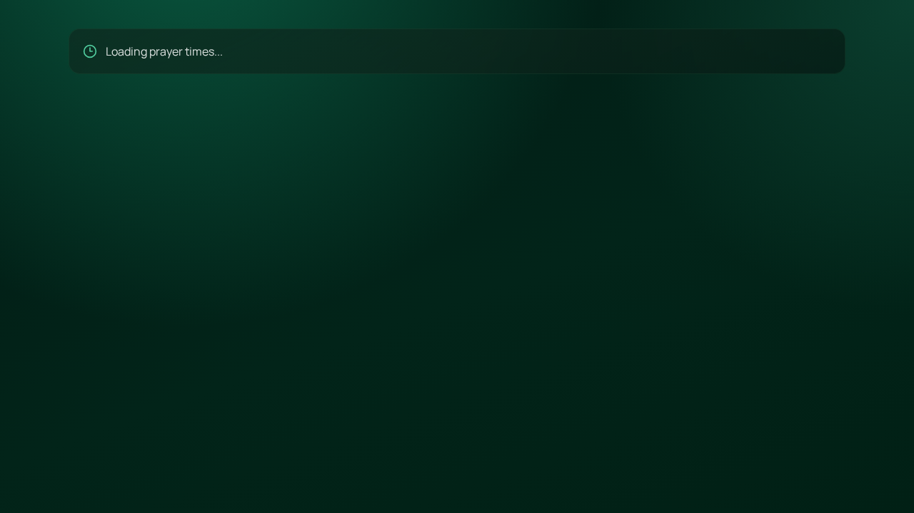
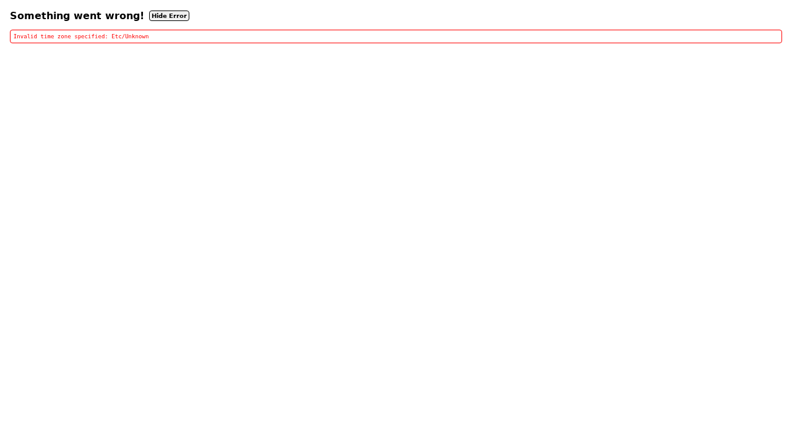

## Puasa Tracker

### What’s included
- Homepage banner: progress bar + total puasa (persistent via Convex)
- New route: `/check-in`
  - Check-in untuk **hari ini** atau **kemarin**
  - Status: **Puasa** / **Tidak Puasa**
  - Jika **Tidak Puasa**: alasan wajib (min 5 karakter)
  - Check-in **locked** (tidak bisa edit setelah submit)

### Screenshots

**Homepage**

**Check-in page**

### Setup notes (Convex)
Tambahkan env var:
- `VITE_CONVEX_URL=...`

Lalu jalankan Convex dev / deploy sesuai project Convex kamu.
